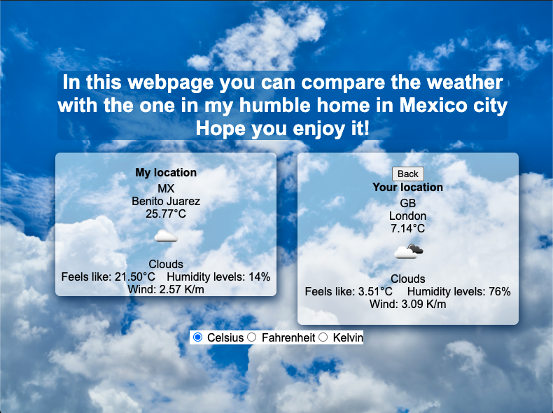

# Weather App

> I created a weather website using openweatherapi in which users can find by city or by geolocation and compare the weather status. Also you can change how the tempeture is display, it can be Celsius, Kelvin, Fahrenheit.

Additional description about the project and its features.

## Built With

- HTML,
- CSS,
- Javascript
- OpenWeatherApi

## Live Demo

[Live Demo Link](https://rawcdn.githack.com/emasdev/weather-app/feature/webpage/dist/index.html)

### Setup

- clone repository
- open terminal and run 'npm install'
- run 'npm start'
- open index.html insde dist folder

## Authors

👤 **Emanuel González**

- Github: [@emasdev](https://github.com/emasdev)
- Twitter: [@elemasss](https://twitter.com/elemass)
- Linkedin: [@emasdev](https://www.linkedin.com/in/emasdev/)

## 🤝 Contributing

Contributions, issues and feature requests are welcome!

Feel free to check the [issues page](issues/).

## Show your support

Give a ⭐️ if you like this project!

## Acknowledgments

- openweatherapi

## 📝 License

This project is [MIT](lic.url) licensed.
